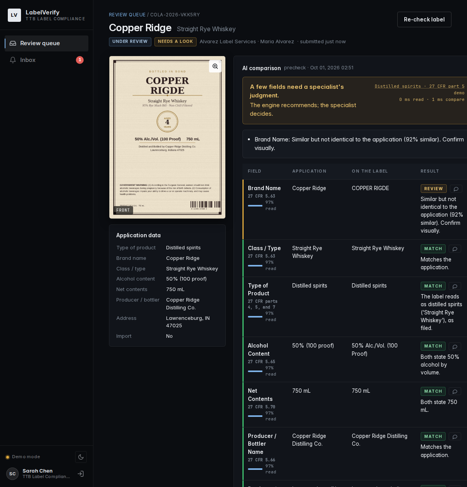
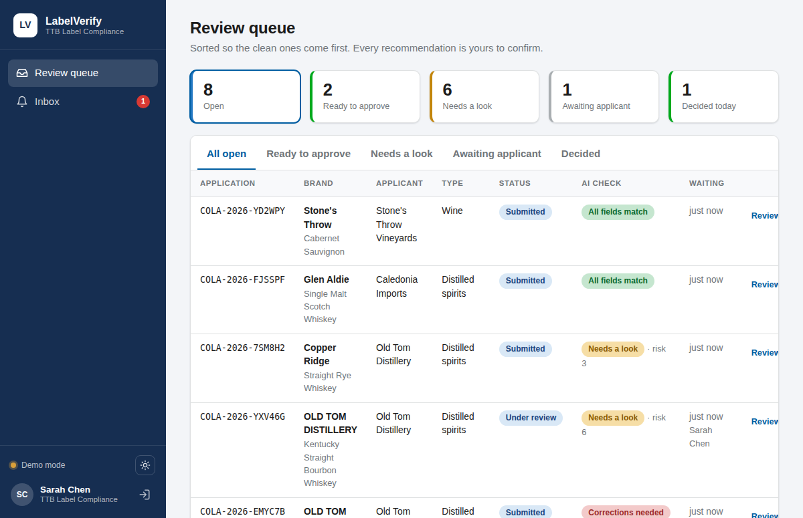
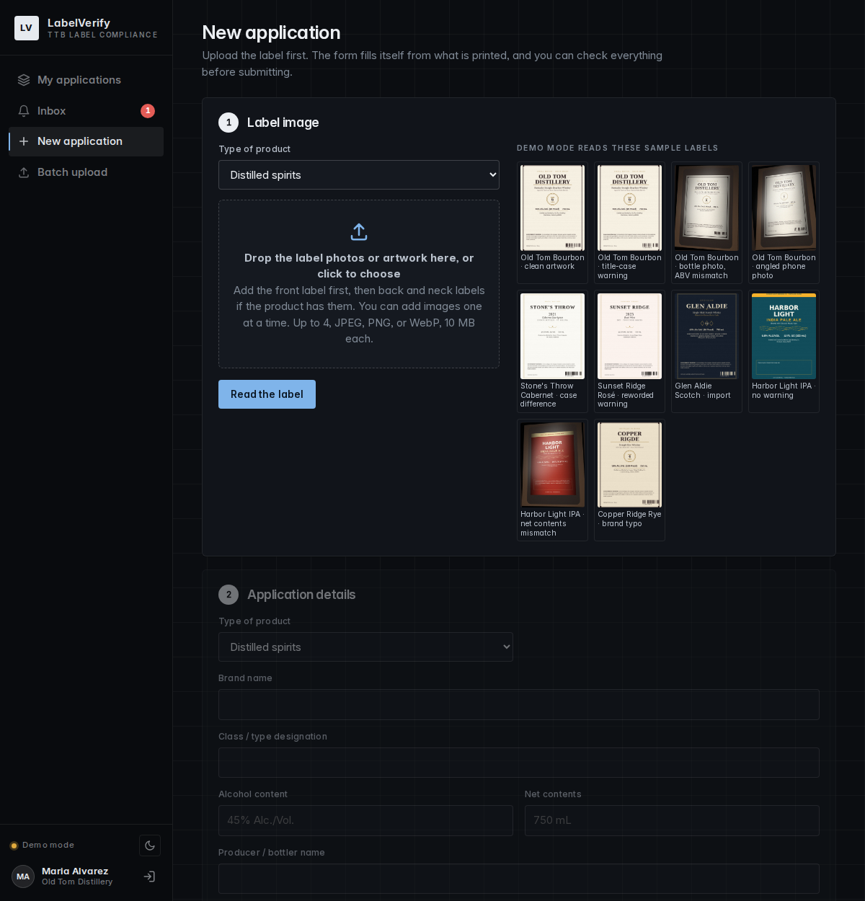
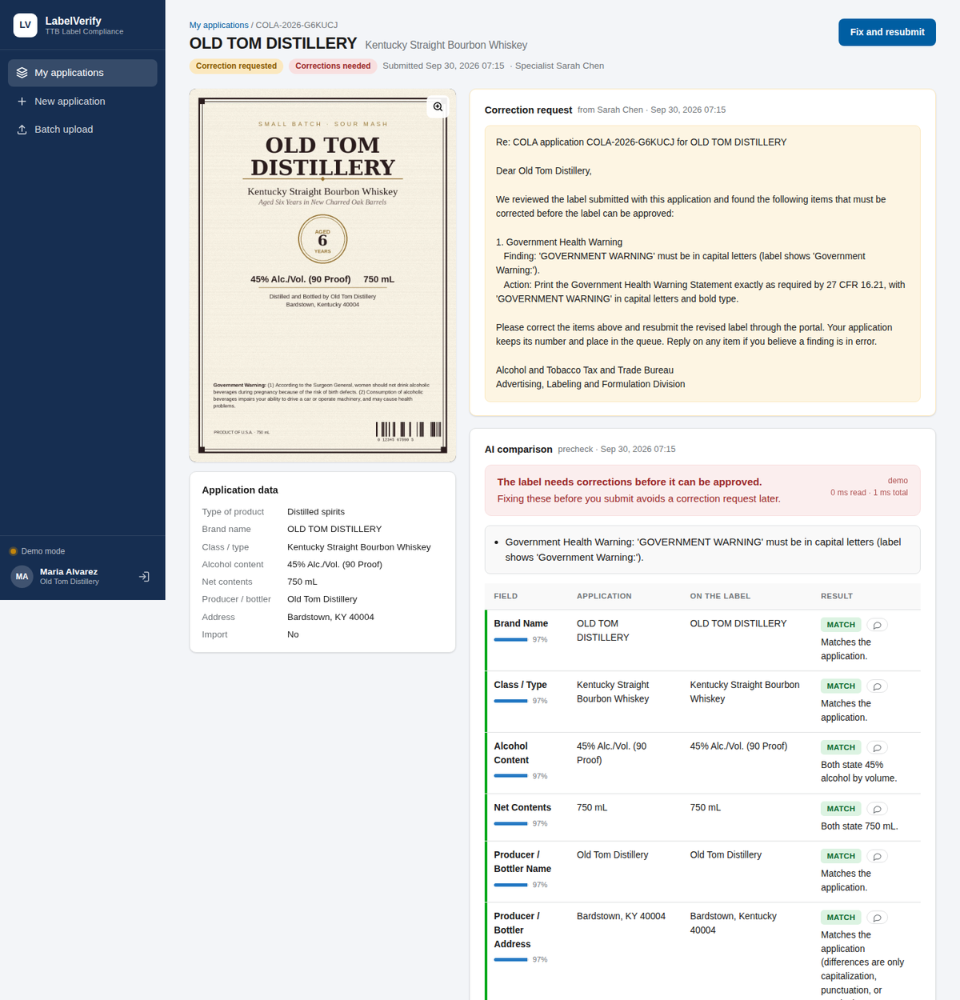

# LabelVerify

AI-assisted alcohol label verification for TTB COLA review.

Applicants upload label artwork, the engine reads it and compares every required field
against the application, and a labeling specialist confirms the result. The tool
recommends; a person decides.



## What it does

**For applicants**

- Upload the label first, front and back panels together if the product has both. Images
  can be added one at a time, removed individually, and reordered; the application form
  fills itself from what is printed across all panels.
- Run a pre-check before submitting and fix problems while they are cheap.
- See correction requests as plain-language notices, reply on the exact field in
  question, and resubmit with a revised label. The application keeps its number.
- Batch upload: a CSV of applications plus a zip of images, up to 300 at a time, checked
  in the background with live progress.

**For labeling specialists**

- A queue sorted so applications where every field matched come first, with tabs for
  "ready to approve", "needs a look", and "awaiting applicant".
- A review screen with the label image, a field-by-field comparison with confidence per
  field, a word-level diff of the Government Health Warning, and a comment thread on
  every field.
- One-click approve, bulk approve for clean applications, or a correction request whose
  notice is drafted from the findings and edited before it goes out.

Both roles get a light and a dark theme. The app follows the system preference and the
toggle in the sidebar overrides it per browser.

**The engine** (no web dependency, fully unit tested)

| Field | Strategy | Example that matches |
| --- | --- | --- |
| Brand name, class/type, producer | Identical after normalization (case, punctuation, spacing, synonyms). Similar but different goes to a human. | `STONE'S THROW` = `Stone's Throw`; `Whisky` = `Whiskey` |
| Alcohol content | Parsed to % ABV; proof converted; label proof must equal 2 × ABV | `45% Alc./Vol. (90 Proof)` = `45` = `90 proof` |
| Net contents | Parsed to mL; standard-of-fill sizes noted | `750 mL` = `0.75 L` = `75 cL` |
| Country of origin | Required for imports only; aliases folded | `Product of Scotland` = `United Kingdom` |
| Health warning | Word for word against 27 CFR 16.21; `GOVERNMENT WARNING` must be all caps; bold is a visual judgment that goes to review when uncertain | exact statutory text |

Per-field verdicts are match, needs review, mismatch, or not applicable. A match read at
low confidence is downgraded to needs review. The roll-up is approve, needs review, or
request correction.

## Run it locally

Requires Python 3.11+ and [uv](https://docs.astral.sh/uv/).

```bash
git clone https://github.com/ezhucs1/ttb-takehome && cd ttb-takehome
uv venv && uv pip install -e ".[dev]"
cp .env.example .env                                          # optional: add ANTHROPIC_API_KEY (read at startup)
.venv/bin/uvicorn labelverify.web.app:serve --factory --reload  # http://127.0.0.1:8000
```

Sign in with one of the demo accounts shown on the login page (password `labelverify`):

| Role | Account | What to try |
| --- | --- | --- |
| Labeling specialist | sarah.chen@ttb.gov | Open the queue, review a "needs a look" item, draft a correction notice |
| Applicant | labels@oldtomdistillery.com | Start a new application from a sample label, run the pre-check, submit; fix the one awaiting correction |
| Applicant | imports@caledonia-imports.com | Batch upload with the template CSV and the sample images |

The database is seeded on first start with ten sample applications in a mix of states so
every screen has content.

**Without an API key** the app runs in demo mode: the ten bundled sample labels work end
to end, and uploading your own image gives a clear message instead of a made-up result.

**With `ANTHROPIC_API_KEY` in `.env`** (or the environment) the vision extractor reads any label you upload, and the
correction notice is rewritten by the model before the specialist edits it. Every result
shows extraction time so you can check it against the five-second budget.

**With `GEMINI_API_KEY` instead** the same flow runs on Google Gemini (the free tier is
enough to try it). Set `LABELVERIFY_EXTRACTOR=gemini` to force it when both keys are
present. The free tier allows a small number of requests per minute, so batch uploads
will pace themselves with retries.

Optional: install `tesseract` (`apt install tesseract-ocr` or `brew install tesseract`)
and set `LABELVERIFY_EXTRACTOR=tesseract` to run the local OCR fallback.

Compare extractors on the same label from the command line:

```bash
.venv/bin/python -m labelverify.cli extract labelverify/samples/old-tom-angled-photo.jpg --extractor claude
.venv/bin/python -m labelverify.cli extract labelverify/samples/old-tom-angled-photo.jpg --extractor gemini
.venv/bin/python -m labelverify.cli extract ~/Pictures/my-bottle.jpg --extractor gemini   # any photo of yours

# Median latency per extractor on one image (what the five-second budget is measured against)
.venv/bin/python -m labelverify.cli bench labelverify/samples/old-tom-angled-photo.jpg --extractors claude,gemini --runs 3
LABELVERIFY_MODEL=claude-haiku-4-5 .venv/bin/python -m labelverify.cli bench labelverify/samples/old-tom-angled-photo.jpg --extractors claude
```

### Sample labels

Ten labels rendered in four visual styles, three of them passed through a photo
simulation (bottle curvature, perspective, glare, grain, blur). Each demonstrates one
outcome:

| Label | Demonstrates | Expected |
| --- | --- | --- |
| Old Tom Bourbon, clean artwork | Everything matches | Approve |
| Old Tom Bourbon, title-case warning | `Government Warning:` instead of caps | Request correction |
| Old Tom Bourbon, bottle photo | Label 40% vs application 45% | Request correction |
| Old Tom Bourbon, angled phone photo | Low confidence on small print, bold unknown | Needs review |
| Stone's Throw Cabernet | `STONE'S THROW` vs `Stone's Throw` | Approve |
| Sunset Ridge Rosé | Warning reworded ("can cause health issues") | Request correction |
| Glen Aldie Scotch | Import, `Product of Scotland` vs `United Kingdom` | Approve |
| Harbor Light IPA | No warning statement at all | Request correction |
| Harbor Light IPA, can photo | 16 fl oz on label vs 12 fl oz on application | Request correction |
| Copper Ridge Rye | Brand printed `COPPER RIGDE` | Needs review |

Regenerate them with `.venv/bin/python scripts/make_samples.py`.

### Tests

```bash
.venv/bin/python -m pytest     # 181 tests, all offline with a fake API client
.venv/bin/ruff check .         # lint
```

Coverage: normalizers and parsers, every comparison rule, the health-warning rules and
diff, image preprocessing, all three extractors (Claude against a fake client), the
workflow services against a throwaway SQLite database, every HTTP route for both roles,
batch processing, and one test per sample label asserting the promised recommendation.

## Deploy

**Docker**

```bash
docker build -t labelverify .
docker run -p 8000:8000 -v labelverify-data:/app/data -e ANTHROPIC_API_KEY=... -e SECRET_KEY=... labelverify
```

**Fly.io** (always-on machine, persistent volume): see `fly.toml`. Railway or Render work
the same way; use a paid or always-on tier so the demo does not hit a cold start, which is
exactly the vendor-pilot failure from the interviews.

## Configuration

| Variable | Default | Purpose |
| --- | --- | --- |
| `ANTHROPIC_API_KEY` | | Enables the vision extractor and notice rewriting |
| `GEMINI_API_KEY` | | Enables the Gemini extractor and, by default, Gemini wording of correction notices |
| `LABELVERIFY_NOTICE_PROVIDER` | `gemini` if its key is set, else `claude`, else `template` | Who rewrites correction notices; the findings always come from the engine |
| `LABELVERIFY_GEMINI_MODEL` | auto | Gemini model; blank picks the newest stable Flash model from Google's model list, and a retired name falls back to the replacement Google suggests |
| `LABELVERIFY_EXTRACTOR` | `claude`, else `gemini`, else `demo`, by which key is set | `claude`, `gemini`, `tesseract`, or `demo` |
| `LABELVERIFY_MODEL` | `claude-sonnet-5-5` | Extraction model. Measured: Sonnet 5.5 4.1 s, Opus 5.5 6.0 s on the hardest sample; `claude-haiku-4-5` is faster if its reads hold up |
| `LABELVERIFY_NOTICE_MODEL` | `claude-opus-5-5` | Claude model for the notice rewrite when the provider is `claude` |
| `LABELVERIFY_EXTRACT_TIMEOUT` | `20` | Seconds before an extraction call is abandoned |
| `LABELVERIFY_IMAGE_MAX_EDGE` | `1500` | Long edge in pixels after preprocessing; smaller is faster, larger keeps more small-print detail |
| `DATABASE_URL` | `sqlite:///./data/labelverify.db` | SQLAlchemy URL; Postgres works unchanged |
| `SECRET_KEY` | random per process | Signs session cookies; set it in any shared deployment |

## How it is built

```
labelverify/
  engine/                 pure verification logic, no web imports
    models.py             ApplicationData, LabelExtraction, VerificationResult
    normalize.py          text, ABV, volume, address, country normalizers
    warning.py            health warning rules and word diff
    compare.py            per-field rules and roll-up
    preprocess.py         EXIF rotation, 1500 px downscale, JPEG re-encode
    notices.py            correction notice template and optional model rewrite
    verify.py             orchestration with timing and fallback
    extractors/           claude and gemini (vision), tesseract (local OCR), demo (samples), fixture (tests)
  web/
    app.py                FastAPI factory, session middleware, error handlers
    models.py             SQLAlchemy tables: users, applications, images, runs, comments, events, notices, batches
    services.py           every state change: create, verify, submit, review, decide, resubmit, batch
    routes/               shared (auth, images, comments), applicant, specialist, api
    templates/            Jinja2 pages and partials
    static/               one stylesheet, one script, no external assets
  samples/                bundled labels and manifest
  cli.py                  command-line verify/extract for latency checks
scripts/make_samples.py   renders the sample labels
docs/                     decisions.md, production.md, screenshots
tests/                    pytest suite
```

Request flow for one check: image bytes → preprocess → extractor → `LabelExtraction` →
compare against `ApplicationData` → `VerificationResult` stored as a run on the
application. No model is involved in the comparison step.

## Screens

| Specialist queue | Applicant pre-check | Correction loop |
| --- | --- | --- |
|  |  |  |

## Documentation

- [docs/decisions.md](docs/decisions.md): engineering decisions with alternatives and reasoning
- [docs/production.md](docs/production.md): what a production deployment would need (identity, FedRAMP, firewall, storage, evaluation)

## Assumptions and limitations

- Cloud model access is allowed for the prototype. The interviews flag that TTB's network
  blocks many outbound domains; the extractor interface, the Tesseract fallback, and the
  absence of any CDN-loaded assets are the mitigations, and `docs/production.md` names
  the Azure-hosted path.
- Up to four images per label set (front, back, neck). They are read together in one
  model call and each field is reported once.
- Only the seven fields named in the brief are checked; beverage-specific rules are not.
- Bold detection on the warning heading is a visual judgment and is surfaced for review
  rather than failed automatically.
- Sample labels are synthetic renders, not real COLA images.
