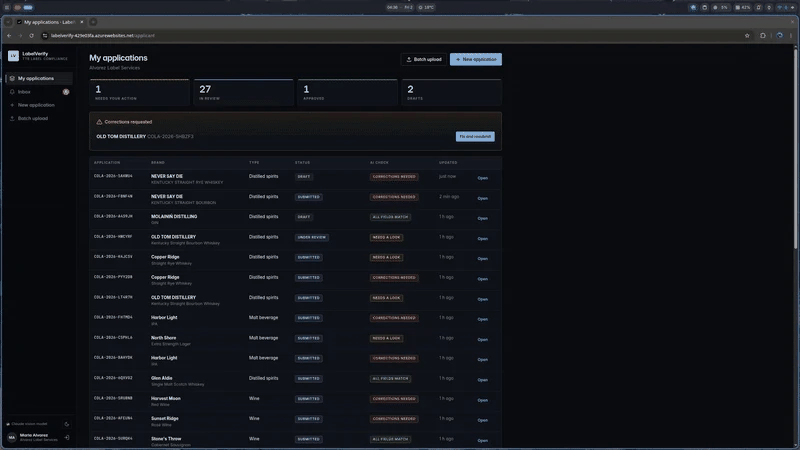
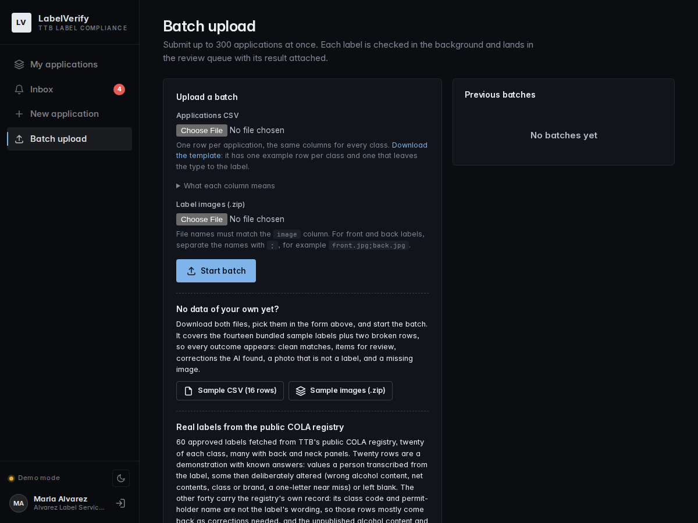
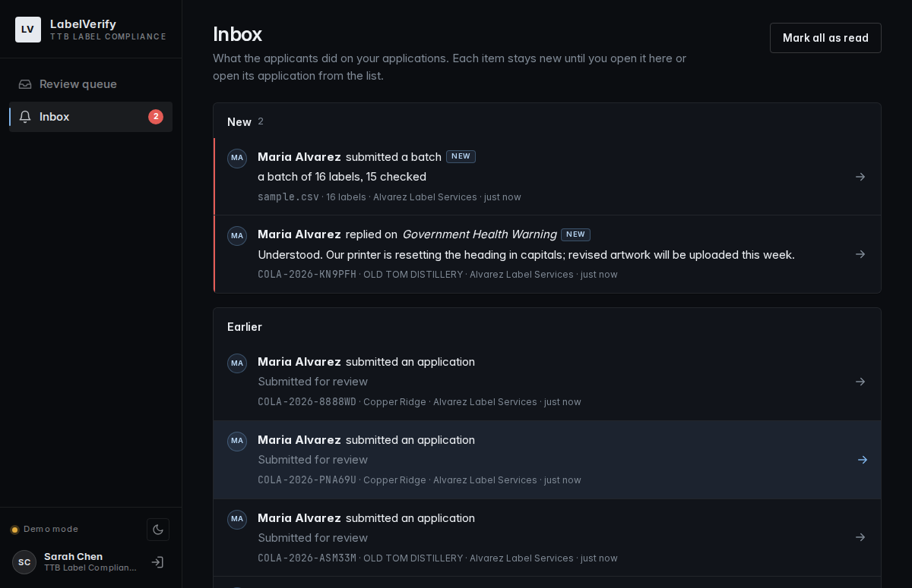
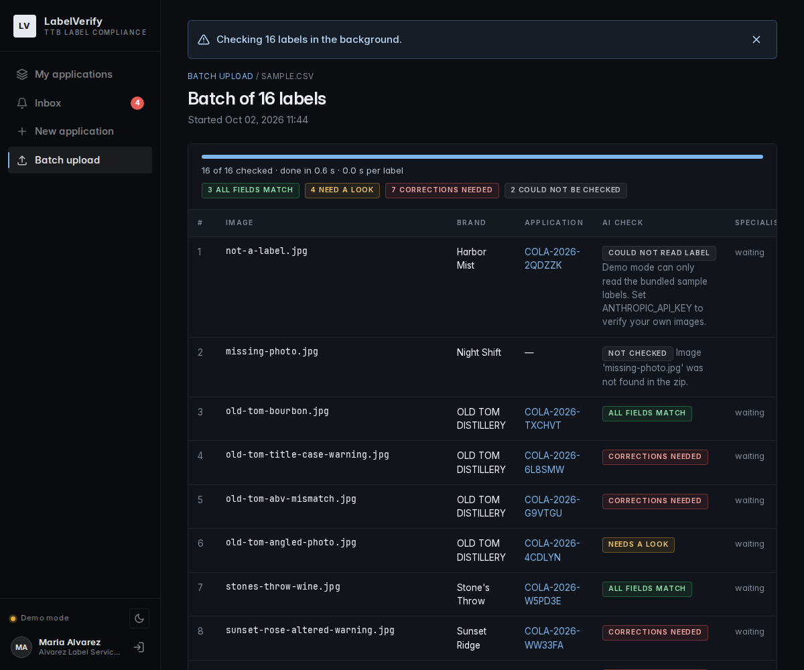
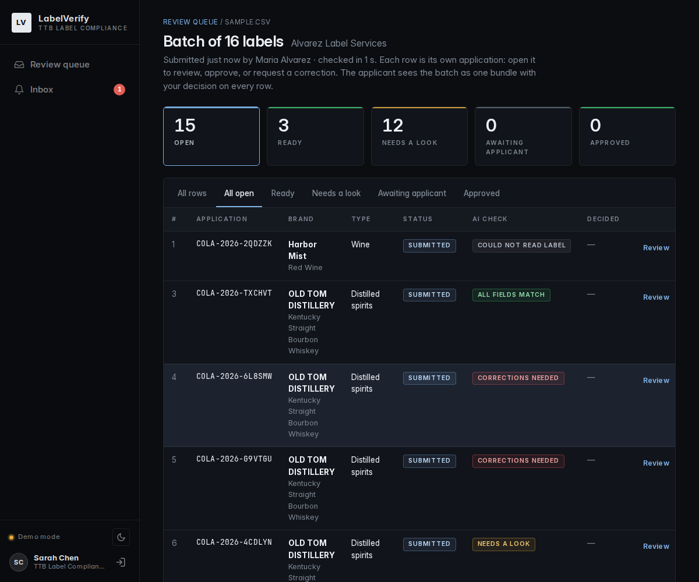

# LabelVerify

AI-assisted alcohol label verification for TTB COLA review. Applicants upload label
artwork, the app reads it and compares every required field against the application,
and a labeling specialist confirms the result. The tool recommends; a person decides.

**Live demo:** a deployed, always-on copy runs on Azure App Service. Its address is shared
with the reviewers directly rather than published here, so that the model budget behind it
is spent by the people it is meant for. Sign in with the accounts listed under "Demo
accounts" below.

> **A note for testers.** The live demo reads labels with a paid vision model on a
> limited budget. One label costs roughly $0.02 to $0.06 to read, and the sixty-label
> registry batch about a dollar. Please test with that in mind: try single uploads
> freely, run the batch uploads two or three times at most, and go easy on repeated
> re-checks. Thank you for testing with consideration for the developer.



## What it does

| For applicants | For labeling specialists |
| --- | --- |
| Upload the label (front, back and neck panels together); the form fills itself from what is printed, with a note that the applicant must check and correct it | A queue, newest first, with tabs for ready, needs a look, awaiting applicant and approved; batch submissions as one bundle above the single applications |
| Run a pre-check before submitting and fix problems while they are cheap | A review screen with the label beside a field-by-field comparison, confidence per field, a word-level diff of the Government Health Warning, and a thread on every field |
| Receive correction requests as plain-language notices, reply on the exact field, resubmit with a revised label under the same number | One-click approve, bulk approve for clean rows, or a correction request whose notice is drafted from the findings and edited before it goes out |
| Submit up to 300 applications at once as a CSV plus a zip of images, with live progress, a summary and a results CSV | An inbox that says what is new, counting a batch once |

The comparison itself is deterministic code, not a model: the model only reads the label.
Every verdict carries its reason and the regulation it rests on (27 CFR parts 4, 5, 7
and 16). The documents under `docs/` explain how.

## Run it locally

Requires Python 3.11+ and [uv](https://docs.astral.sh/uv/). No API key is needed.

```bash
git clone https://github.com/ezhucs1/ttb-takehome && cd ttb-takehome
uv venv && uv pip install -e ".[dev]"
.venv/bin/uvicorn labelverify.web.app:serve --factory --reload   # http://127.0.0.1:8000
```

Without a key the app starts in **demo mode**: the fourteen bundled sample labels work
end to end for both roles, the sample batch runs in a second or two, and every screen is
seeded with content. To read **your own label images** locally, install Tesseract and
start the app with local OCR as the reader:

```bash
sudo apt install tesseract-ocr        # macOS: brew install tesseract
LABELVERIFY_EXTRACTOR=tesseract .venv/bin/uvicorn labelverify.web.app:serve --factory
```

The sidebar then says "Local OCR (Tesseract)". OCR reads clean artwork well and misses
small print on photographs; every OCR value is reported as an uncertain read, so matching
rows say "match · uncertain read" and the application goes to review rather than
approval. If the app cannot find the binary, put the path that `which tesseract` prints
in `LABELVERIFY_TESSERACT_CMD`. The live demo uses a vision model instead; how that is
configured, what it costs and how it was measured is in [docs/AI-MODEL.md](docs/AI-MODEL.md).

### Demo accounts

Password for both: `labelverify`. Locally the sign-in dialog lists them; the public
deployment hides the list.

| Role | Account | Start here |
| --- | --- | --- |
| Labeling specialist (TTB) | sarah.chen@ttb.gov | Review queue, Inbox |
| Applicant (a label-compliance agent filing for several producers) | maria@alvarezlabels.com | My applications, New application, Batch upload |

## Try it: three walkthroughs

**1. Applicant: a new application, checked before it is sent.** Sign in as Maria and
open *New application*. In step 1 pick a sample label (locally) or drop your own photo
(live demo or OCR mode); up to four panels. Click *Read the label*: the status line shows
how long the read took and which reader did it. Step 2 is filled from the read; check
every field, because the check compares what you file against the label, and switch the
type of product if the detected one is wrong. The "also on the label" group holds the
statements for that class (qualifying phrase, warning text, sulfites, vintage, age and so
on), each editable. *Check before submitting* shows the result table in milliseconds;
fix the form and check again, then *Submit*.

Suggested samples: "Old Tom Bourbon · clean artwork" approves; "title-case warning"
shows a word-level diff and a corrections-needed verdict; "angled phone photo" shows
uncertain reads routed to review; "Copper Ridge Rye · bonded at 90 proof" shows a hard
rule finding.

**2. Specialist: the queue, a decision, a notice.** Sign in as Sarah. The queue opens
with the submissions newest first; the *Ready* tab holds the ones where every field
matched (bulk approve is there), *Needs a look* the ones with a judgment call. Open one:
the label sits beside the comparison, every row has its citation and a thread for a
question to the applicant. *Request corrections*, then *Draft the notice*: the notice is
built from the findings (a model rewrites the wording on the live demo, the content is
always the engine's), edit it, send it. The Inbox lists every new submission and reply;
one is waiting there from the seeded data.

**3. The correction loop.** Back as Maria, *My applications* shows the correction
request as a notice with a "New" marker and a thread on the flagged field. Reply on the
field, then *Fix and resubmit* with corrected values or new artwork. The application keeps
its number and returns to the same specialist, who sees it in the inbox and the queue.

## Batch upload



*Batch upload* in the applicant sidebar takes a CSV and a zip of images (template on the
page, one example row per class; the type column may be left blank to let the label
decide). Two ready-made sets are offered on the page:

| Set | What it is | Where it runs |
| --- | --- | --- |
| Sample CSV (16 rows) + sample images | The fourteen bundled labels plus two broken rows (a photo that is not a label, a missing image), so the summary shows failures beside the findings | Anywhere, including demo mode, in a second or two |
| COLA registry CSV (60 rows) + images | Sixty approved labels from TTB's public registry, twenty per class, 97 panels. Twenty rows carry hand-transcribed values with known answers (correct, one value wrong, a near miss, blanks); forty carry the registry's own record | Needs a live reader: the live demo (about a dollar per run, so two or three runs at most, please) or local OCR |

The batch page shows progress and a summary, lands every readable row in the specialist's
queue as one bundle, and offers *Download results (.csv)* with each row's verdict, the
flagged fields and the reasons. The registry CSV has a `scenario` and an `expected`
column to compare against; what each scenario should produce, and why the forty
registry rows mostly come back "corrections needed" on approved labels, is in
[docs/TESTING.md](docs/TESTING.md#the-registry-batch-sixty-real-labels).

## Sample labels

Fourteen synthetic labels in four visual styles, three passed through a photo simulation
(curvature, perspective, glare, grain, blur). Each demonstrates one outcome:

| Label | Demonstrates | Expected |
| --- | --- | --- |
| Old Tom Bourbon, clean artwork | Everything matches | Approve |
| Old Tom Bourbon, title-case warning | `Government Warning:` instead of caps | Request correction |
| Old Tom Bourbon, bottle photo | Label 40% vs application 45% | Request correction |
| Old Tom Bourbon, angled phone photo | Low confidence on small print, bold unknown | Needs review |
| Stone's Throw Cabernet | `STONE'S THROW` vs `Stone's Throw` | Approve |
| Sunset Ridge Rosé | Warning reworded ("can cause health issues") | Request correction |
| Glen Aldie Scotch | Import, `Product of Scotland` vs `United Kingdom` | Approve |
| Harvest Moon Red | Vintage date with no appellation of origin | Request correction |
| North Shore Lager | "Extra Strength" on a malt beverage | Needs review |
| Harbor Light IPA | No warning statement at all | Request correction (seeded as rejected, with notice) |
| Harbor Light IPA, can photo | 16 fl oz on label vs 12 fl oz on application | Request correction |
| Copper Ridge Rye | Brand printed `COPPER RIGDE` | Needs review |
| Old Tom Bourbon, no age statement | Whisky with no statement of age | Needs review |
| Copper Ridge Rye, bonded at 90 proof | "Bottled in Bond" at 45% alc/vol | Request correction |

## Screens

| Review queue | Inbox | Applicant batch |
| --- | --- | --- |
|  |  |  |

| New application | Correction loop | Specialist batch bundle |
| --- | --- | --- |
|  |  |  |

## Tests

```bash
.venv/bin/python -m pytest     # 378 tests, all offline
.venv/bin/ruff check .         # lint
```

## Documentation

| Document | What it covers |
| --- | --- |
| [docs/EVALUATION.md](docs/EVALUATION.md) | The brief's deliverables and criteria, mapped to what is here and where it falls short |
| [docs/ARCHITECTURE.md](docs/ARCHITECTURE.md) | System design, pipeline, workflow, database schema, module layout, libraries, configuration, Azure deployment |
| [docs/AI-MODEL.md](docs/AI-MODEL.md) | Where the model sits in the pipeline, prompt design, model choice, cost and time per label and per batch, the OCR fallback |
| [docs/REGULATIONS.md](docs/REGULATIONS.md) | The rules implemented per class with citations, and how strict each check is |
| [docs/TESTING.md](docs/TESTING.md) | The test suite, the real-label runs, bugs found and fixed, latency and cost findings |
| [docs/SECURITY.md](docs/SECURITY.md) | What the app does to protect itself and what a real deployment adds |
| [docs/UI.md](docs/UI.md) | Design rationale: calm, dark, simple, usable by a novice |
| [docs/PROTOTYPE.md](docs/PROTOTYPE.md) | Prototype status, known limits, and what production would need |
| [docs/user-guide.md](docs/user-guide.md) | Every screen, tag and symbol, for the people using it |
| [docs/decisions.md](docs/decisions.md) | The engineering decision log: what was chosen, what was considered, why |
