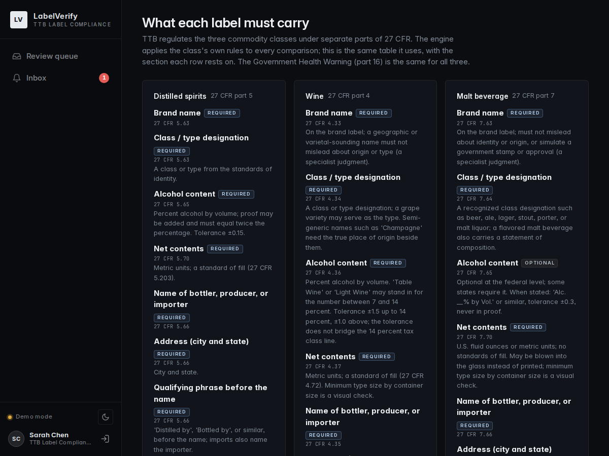

# Regulations implemented, and how strictly

What the engine checks, under which section of 27 CFR, and what each outcome means. The
rulebook is one module, `labelverify/engine/rules.py`; it drives the comparisons, the
applicant's step-2 form, the citation under every result row, and the `/rules` page in
the app.

## The three verdict levels

| Verdict | Meaning | Examples |
| --- | --- | --- |
| **Match** | Identical after normalization: case, punctuation, spacing, standard abbreviations (CA for California), synonyms (Whisky, Whiskey); numbers compared as numbers | `STONE'S THROW` = `Stone's Throw`; `45% Alc./Vol. (90 Proof)` = `45` = `90 proof`; `750 mL` = `0.75 L` |
| **Needs review** | Similar but not identical, within a labeling tolerance, or something only a person can settle; the reason says which | `COPPER RIGDE` (92% similar); 13.9 filed against 14.0 printed; "Gin" filed for "Blood Orange Forward Gin"; a whisky with no age statement |
| **Mismatch** | A difference the rules do not allow, or a required item missing from the label | 40% printed, 45% filed; a reworded warning; "Bottled in Bond" at 90 proof; a vintage with no appellation |
| Not applicable | The rule does not apply here | Country of origin on a domestic product; sulfites on a spirit |

Nothing looser than identical counts as a match (decisions.md, entry 3): an early draft
treated 92% similarity as a match and approved "DISTILERY" for "DISTILLERY". A typo in a
brand name is a real defect, so near misses go to a person. The roll-up is **approve**
(every row matched on a confident read), **needs review** (at least one review item or
uncertain read), or **request correction** (at least one mismatch).

A difference inside a class's alcohol tolerance is a review item rather than a match,
because the tolerance governs actual against labeled content while the application
should carry the labeled figure exactly. Standards of fill are advisory (a note, never a
verdict) because TTB's list changes; the engine carries the January 2025 sizes.

## The fields the brief names

| Field | Rule | Citations |
| --- | --- | --- |
| Brand name | Required; identical after normalization. A filed brand that equals the label's second product name (`fanciful_name`) is a match with a note; a near miss to it is a review item. The producer's name alone does not make a brand | 5.63, 4.33, 7.63 |
| Class / type | Required; identical after normalization. A filed class that appears whole inside a longer printed designation is a review item (the regulations allow descriptive words beside the class); a different class is a mismatch. A malt beverage designation must contain a recognized class word (beer, ale, lager, stout, porter, malt liquor, ...) or it goes to review | 5.63, 4.34, 7.64 |
| Alcohol content | Parsed to percent by volume; proof converted and must equal twice the percentage; the statement must carry the words alcohol, alc, or abv or it goes to review. Spirits: required, ±0.15, proof permitted. Wine: required, "Table Wine" may replace the number at 7 to 14%, ±1.5 up to 14% and ±1.0 above, never across the 14, 21 or 24% tax class lines. Malt: optional federally, ±0.3 when stated, never in proof | 5.65, 4.36, 7.65 |
| Net contents | Parsed to millilitres. Spirits and wine: metric required; standards of fill noted. Malt: fluid ounces or metric, no standards of fill, and the statement may be blown into the glass, so a missing one is a review item rather than a finding | 5.70 (5.203), 4.37 (4.72), 7.70 |
| Producer / bottler name | Required; the name after the qualifying phrase. Trade name or legal name matches whichever the label prints; entity suffixes (Inc., LLC, Co.) are ignored; in "Bottled by A for B" the producer is A | 5.66, 4.35, 7.66 |
| Producer / bottler address | Required; the label needs the city and state, so a filed street address matches when every word the label prints is in it | 5.66, 4.35, 7.66 |
| Country of origin | Required on imports only, in English; aliases folded (Product of Scotland = United Kingdom). A domestic filing whose label names another country is a review item | 5.74, 4.32 with 19 CFR 134, 7.61 with 19 CFR 134 |
| Government Health Warning | Required on every label; the statement is compared word for word with 27 CFR 16.21, differences shown inline. "GOVERNMENT WARNING" must be all capitals (a hard finding) and bold: a reader that says the heading is not bold sends the row to review, a reader that cannot tell adds a note, since type weight is hard to judge from an image and the specialist has the image beside the table. A hyphen at a line break joins the halves | 16.21, 16.22 |

Two more rows appear on every result: **Type of product** (the class the label implies
must be the class filed; when none was filed the label decides and that class's rules
apply, and the record says so) and the **qualifying phrase** before the producer's name
("Distilled by", "Produced and bottled by", "Brewed by"; imports must also name the
importer).

## Class-specific statements

These rows appear when the class and the label call for them. The applicant files each
statement exactly as printed (step 2 shows them per class, prefilled from the read); the
engine compares the filing with the read and still checks the label itself against the
rule, whatever was filed.

| Class | Statement | Rule | Citation |
| --- | --- | --- | --- |
| Wine | Sulfite declaration | Required at 10 ppm or more; the label cannot show the level, so a missing statement is a review item, not a failure | 4.32(e) |
| Wine | Appellation of origin | When the label names one, shown with its citation; grape-source percentages are a records check | 4.25 |
| Wine | Vintage year | Allowed only with an appellation of origin; a vintage with none, or one in the future, is a finding | 4.27 |
| Wine | Estate Bottled | Requires a viticultural area appellation on the label; a claim with none is a finding | 4.26 |
| Spirits | Age statement | Whisky under four years must state its age, so any whisky label without one is a review item | 5.141 |
| Spirits | Bottled in Bond | Only when claimed: must be 100 proof, a hard finding otherwise | 5.63 |
| Spirits | Blend percentage | When the class says blended, the percentage of straight whisky must appear | 5.143 |
| Malt | Statement of strength | Wording that emphasizes alcoholic strength is not permitted; a review item, since "strong" inside a style name is a judgment | 7.65 |

How a filed statement compares with the read: filed as printed is a match; a near miss
is a review item; a different number ("Aged 4 Years" against "Aged Six Years") or
statement is a mismatch; filed blank while the label prints one is a review item naming
the printed text; filed when nothing was read is a mismatch. A filing that does not
provide a statement (a batch CSV without the column) is checked against the rules alone.

## Listed for the specialist, not judged

Rules the engine cannot settle from a transcription are shown on the rules page and the
result as the specialist's checks: state of distillation (5.142), varietal and
grape-source percentages, type sizes (every part), the liqueur tolerance in 5.65,
brand-name restrictions (misleading identity or origin, simulating a government stamp),
the statement of composition on a flavored malt beverage, and anything that needs the
formula or the records behind the label.

## Strictness on real labels

The sixty approved registry labels show what strict means in practice. The forty rows
filed with the registry's own record mostly come back "corrections needed", and that is
correct behaviour: the public registry publishes a class code ("Other Gin") rather than
the printed designation ("American Gin"), sometimes the permit holder's trade name
rather than the biggest words on the label, and no alcohol content or net contents at
all. The engine's job is to compare the application as filed with the label as printed;
when they differ it says precisely which value and why. Two of the sixty approved labels
have Government Health Warnings that depart from the statutory text, and the check flags
both. Where the engine was charging labels for the registry's formatting rather than a
real difference (street addresses against city and state, trade against legal names, a
brewery name against a product name, a hyphen at a line break), it was corrected
(decisions.md, entry 26). The engine is strict on the words the regulation fixes and
accepts the variation the regulation allows.

## How the rulebook was validated

Parts 4, 5 and 7 were walked section by section (decisions.md, entries 12, 15, 17) and
the citations cross-checked against a curated regulation summary and the eCFR table of
contents; the live eCFR could not be reached from the build environment, so the rules
page says to read the full text for anything consequential. Production would review the
rulebook against eCFR on a schedule.
